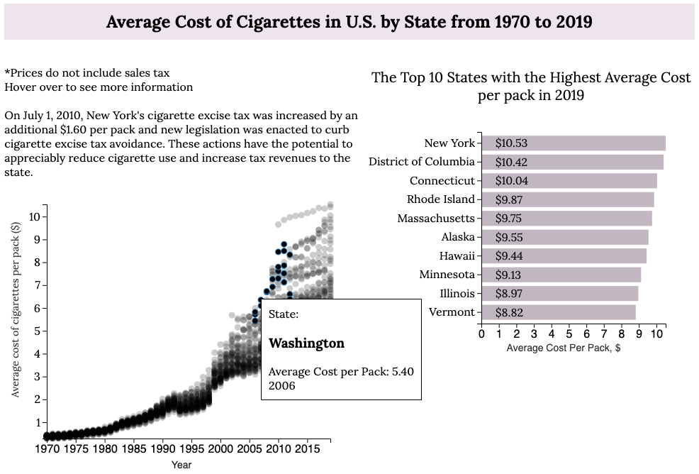
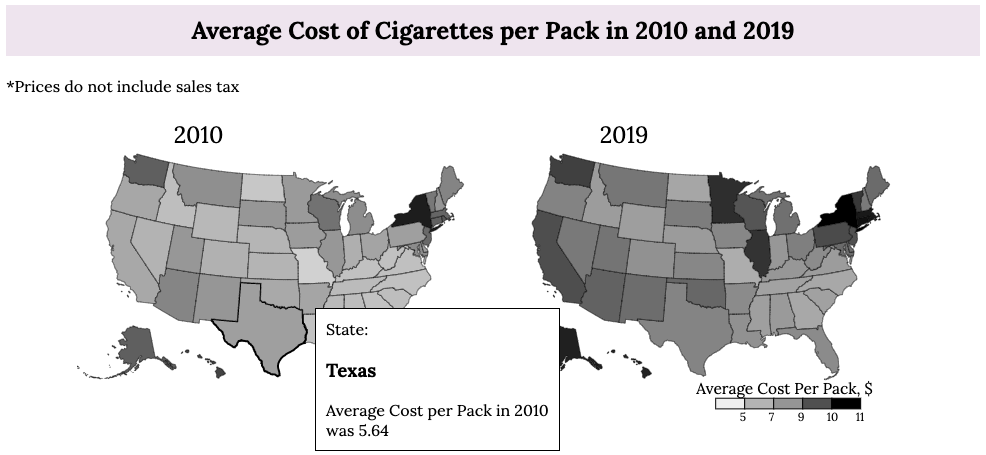
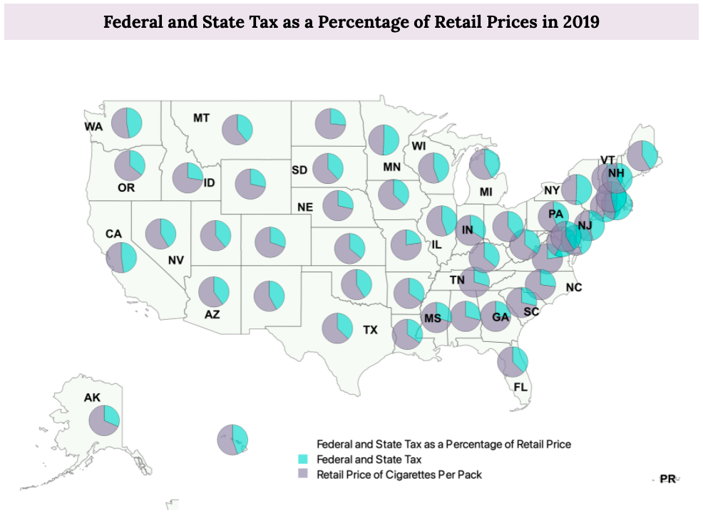
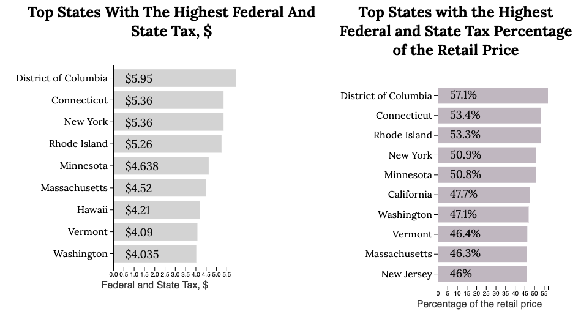
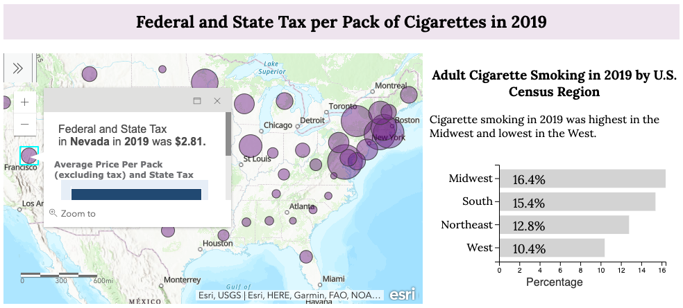
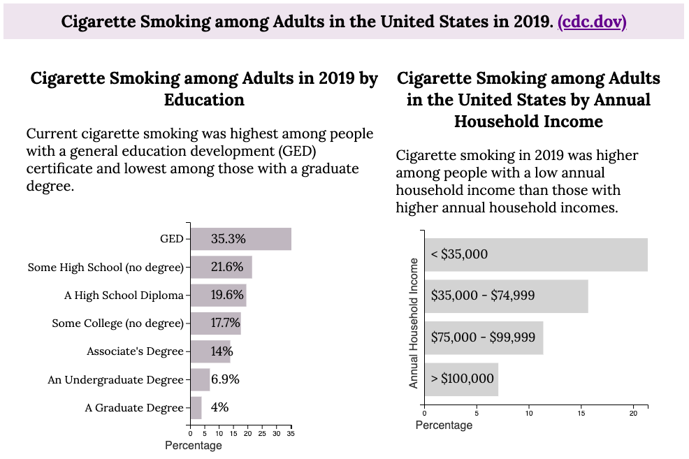
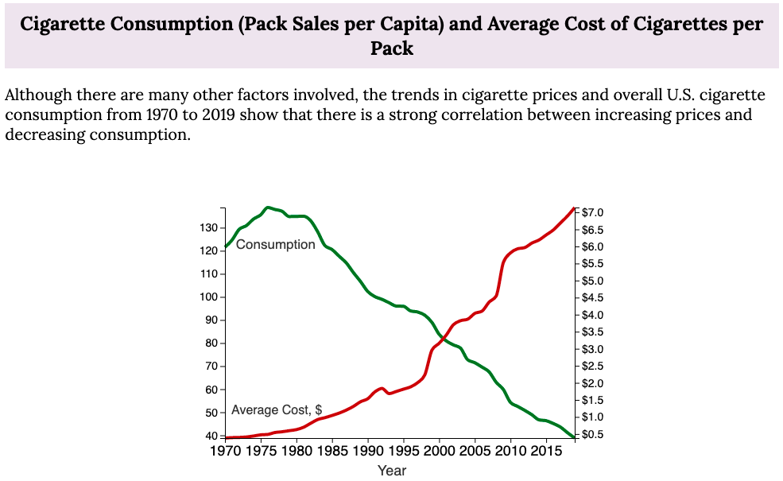

# Does the Cost of Cigarettes Prevent People from Smoking?

The link to the project is [here](https://nchikurova.github.io/www/chart/gis_project/).

This project was created for DATA 78000 Geospatial Humanities and Spatial Data Analysis and Visualization class with Dr. Shipeng Sun at the CUNY Graduate Center, Spring 2021.

Being born and raised in Russia, I know that the price of cigarettes over there is very low and has never stopped anyone from smoking. After moving to the US, I was shocked at how expensive cigarettes in this country were. I couldn’t stop wondering if the cost of the cigarettes would change the number of people who smoke. I decided to take a look at the correlation between the average cost of cigarettes and the cigarette consumption in the United States.

I use few sources of data for this project. Main one is Centers for Disease Control and Prevention and their data from data.gov: [The Tax Budren on Tobacco, 1970-2019](https://catalog.data.gov/dataset/the-tax-burden-on-tobacco-1970-2018-ea78d). Categorical data is taken from [Current Cigarette Smoking among Adults in the United States](https://www.cdc.gov/tobacco/data_statistics/fact_sheets/adult_data/cig_smoking/index.htm#:~:text=In%202019%2C%20nearly%2014%20of,with%20a%20smoking%2Drelated%20disease.). For preparing, analyzing and visualizing data for this project I used Excel, Python (Jupyter Notebooks), QGIS, ArcGIS and D3.js.

## Data Preparation:

The Tax Burden on Tobacco, 1970-2019 data consists of the data collected from 51 states from 1970 to 2019. The data provides GeoLocation of each state as a pair of coordinates. To use these data points in QGIS and other analyses, I had to get rid of the parenthesis and separate latitude from longitude. I did this in Jupyter Notebooks. The example of the code could be found [here](https://github.com/nchikurova/www/blob/main/chart/gis_project/State_tax_per_pack.ipynb). 

To visualize states as polygons I used [usState.json](https://github.com/nchikurova/www/blob/main/chart/data/usState.json).

The Tax Burden on Tobacco, 1970-2019 data includes:
-	*Average Cost per pack*: Average Cost Per Pack is the weighted average of the cost of a pack of cigarettes. These prices also do not include sales tax.
-	*Cigarette Consumption (Pack Sales Per Capita)*: Tax-paid sales represent the number of packs in a given state for which state excise taxes were paid (either through the purchase of stamps by a wholesale/distributor or through the filing of a monthly return by the wholesaler/distributor. For tax-paid sales per capita, the number of tax-paid sales for the state is divided by the population for the state as estimated by the U.S. Census Bureau for the relevant year. The population figures used for the states are Census Bureau estimates as of July 1 of the respective fiscal years.
-	*Federal and State Tax as a Percentage of Retail Price*: Federal and State Tax as a Percentage of Retail Price is the amount of federal and state tax as a percentage of the retail price for a pack of cigarettes.
-	*Federal and State Tax per Pack*: Federal and State Tax Per Pack is the dollar amount of federal and state tax combined for each pack of cigarettes.
-	*Gross Cigarette Tax Revenue*: Annual Gross Tax Revenue from Cigarettes is the yearly gross tax revenue generated from the sale of cigarettes measured in thousands of dollars. Data is based on fiscal years ending June 30.
-	*State Tax per pack*: State Tax Per Pack is the amount of state tax applied to each pack of cigarettes.

For further analyses I separated these categories into different datasets using Excel and function Filter.

## Data Analyses and Visualization:

### Average Cost of Cigarettes in U.S. by State from 1970 to 2019

  

First section includes the scatterplot chart of the average cost of cigarettes per pack from 1970 to 2019 by state. I wanted to show the overall picture of how the average price of cigarettes has changed for the past 50 years. This chart clearly shows the growth of the prices and by hovering over the points you can see the average cost of cigarettes per pack in each state and each year from 1970 to 2019. 

Here we can see that from 2010 to 2019 there are data points that are much higher than all other states. On July 1, 2010, New York's cigarette excise tax was increased by an additional $1.60 per pack and new legislation was enacted to curb cigarette excise tax avoidance. These actions have the potential to appreciably reduce cigarette use and increase tax revenues to the state.

- [Cigarette Tax Increase to Keep the State Running](https://www.nytimes.com/2010/06/22/nyregion/22budget.html)
- [State Cigarette Excise Taxes, United States -2010-2011](https://www.cdc.gov/mmwr/preview/mmwrhtml/mm6112a1.htm)
         
On the right side I decided to highlight the top 10 states with the highest average cost per pack in 2019. 

### Average Cost of Cigarettes per Pack in 2010 and 2019

Second section includes two choropleth maps of the United States that represent the average cost of cigarettes per pack by color. On the left the map represents the cost in 2010 and on the right – 2019. I used the same color domain for both maps so the viewer can see the difference in prices by darkness of each state.
 
Both maps are made in d3.js, using geoAlbersUSA projection, usState.json and dataset with the average cost of cigarettes per pack.

### Federal and State Tax as a Percentage of Retail Prices in 2019

For the next section I decided to use one of the QGIS features: creating diagrams for each data point. As the first step, since my dataset includes years from 1970 to 2019, I filtered data in Properties -> Query Builder -> “Year” = 2019. 
 
Then, I created a new column using Open Field Calculator to count “the rest of the percentage of retail prices” by using a formula “100 – Data_Value”, where Data_Value is the federal and state tax as a percentage of retail price. I chose pie chart, because it is the easiest way to show the percentage. As attributes, I assigned Data_Value and the new column I just created.
 
I decreased the capacity of the circles because the circles in the Northeast region overlap.
 
As a size, I chose fixed size, so the overall picture is not clattered. The viewer’s attention will be on the most important part here – the number of percentage.
 
As a continuation of the Federal and State tax section and to make picture clearer for the viewer, I added two bar charts: the top 10 states with the highest federal and state tax measured in dollars (on the left) and the top 10 states with the highest federal and state tax as a percentage of retail price (on the right). Here the viewer can compare federal and state tax in different measurement.
 
For the third part of this section I wanted to show the federal and state tax as a proportional symbol and compare it to the average cost. So, I joined two layers (federal and state tax and average cost per pack) by field value (states) and created an interactive [map in ArcGIS](https://arcg.is/1HjeSm), adding state tax and average price per pack as a bar chart in pop up figure. Labels are added in very large scale only, since the base layer of the map has the name of the states by default.

On the right side of this map is the bar chart that represents adult cigarette smoking in 2019 by U.S. Census Region. Here, the viewer can see the correlation between the value of federal and state tax by state and the adult cigarette consumption by region.
 
### Cigarettes Smoking among Adults in the United States by Category in 2019

I already explored how the average cost per pack and tax have been growing over the years. In this section I wanted to see the relation between cigarettes consumption and, in my opinion, are the most money-related factors: annual income and level of education. 

Surprisingly, the more money people make the less they smoke. About 20 out of 100 people who have annual household income lower than $35,000 smoke, while there are only 7% of smokers out of those who make more than $100,000 per year.
 
### Cigarette Consumption (Pack Sales per Capita) and Average Cost of Cigarettes per Pack

For this section I needed to do some analysis in QGIS. To make this line chart I needed to find the average of the cost value in each year and the average of cigarette consumption in each year. I needed to summarize all values in each state per year and find the average of these values.
Using a Query building function in Layer -> Create New layer, I created a new layer by using the following formula:

`Select Year,
sum(Data_Value) as sum_of_values
from Cigarette_consumption
group by Year
order by sum(Data_Value) desc`

Then, I needed to divide the sum of values per each year by 51 – number of states in each year. Using Open field calculator, I created a new column where each of the sum_of_values column value is divided by 51:

Since both layers, cigarette consumption per capita and the average cost per pack, have the same structure, I used the same steps to find average cost among states in each year.

The line chart was created in d3.js.

## Code Structure 

Code could be find [here](https://github.com/nchikurova/www/tree/main/chart/gis_project).

I have changed and reorganized code for this project few times. For anyone who is interesed in particular charts and for my future self I wanted to which `.js` file includes which chart.

### `html` ids of svg containers and their location on the page:

#### Average Cost of Cigarettes in U.S. by State from 1970 to 2019
scatter-wrap:

scatterplot-container (left) and scatter-bar (right)

#### Average Cost of Cigarettes per Pack in 2010 and 2019
map-containers:

map-container (left) and map-container2 (right)

#### Federal and State Tax as a Percentage of Retail Prices in 2019
qgis_map(image)

barchart:

bar-one (left) and bar-two (right)

arcgis-wrapper:

arcgis-map (left) and bar-region (right)

#### Cigarettes Smoking among Adults in the United States by Category in 2019
category:

bar-education (left) and bar-income (right)

#### Cigarette Consumption (Pack Sales per Capita) and Average Cost of Cigarettes per Pack
linechart-wrapper:

linechart

### `.js` files and svg containers in them:

#### `map.js`:
- map-container
- map-container2
- bar-income

#### `barcharts.js`:
- bar-one
- bar-two
- bar-education
- bar-region

#### `scatter_plot.js`:
- scatterplot-container
- scatter-bar

#### `linechart.js`:
- linechart
